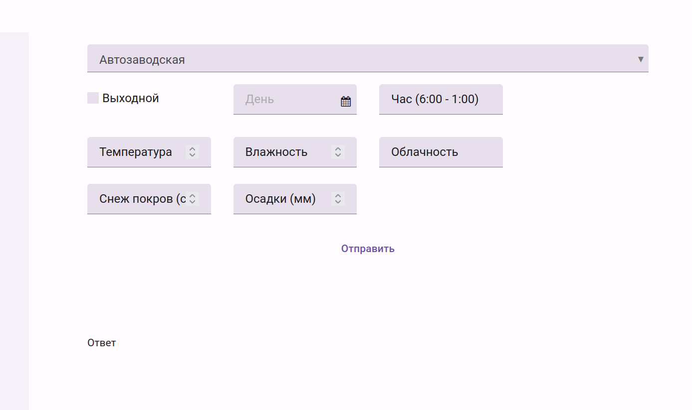
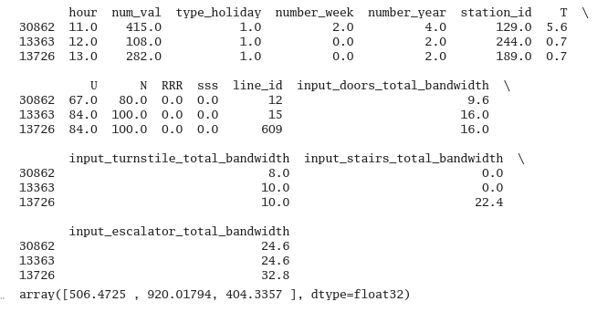

# Набросок решения   
   
## Наш вид MVP   
Сайт, где можно вбить дату и станцию, и вернется прогнозируемая загруженность данной станции   
   
# Модель станции   
В модель станции входят: проп. способность всех дверей, кол-во на вход, пропускная способность эскалатора   
```
class station:
    input_doors_total_bandwidth: int
    input_turnstile_total_bandwidth: int
    input_stairs_total_bandwidth: int
    input_escalator_total_bandwidth: int

```
# Модель часа   
## Погода:   
Так, у нас в модели есть погода: толщина снежного покрова, температура, минимальная температура, погодные условия (дождь/снег), мм осадков   
Мы обучаем модель по архиву погоды c [https://rp5.ru](https://rp5.ru)   
## Праздники:   
Для остлеживания праздников используем pip-пакет holidays   
## Население:   
Также мы видвинули гипотезу, что пассажиропоток в метро зависит от населения, которое проживает вокруг метро.   
Поэтому мы взяли данные перепеси населения Москвы за 01.01.2023 по районам с [Росстата](https://rosstat.gov.ru/storage/mediabank/Bul_MO_2023.xlsx)   
```
class HourCome:
    number_hour: int # 0 to 24
    number_week: int # 0 to 6
    number_year: int # 0 to 365 (если 366 то тупо ставим 365)
    type_holiday: int # 0 - нет 1 - федеральный 2 - попущенный
    count_people: int # количество людей
    #event_people: int # сколько людей планируется на мероприятии # идея

    # weather в теории из openweather map


```
## Веб-сайт   
Для реализации сайта мы выбрали платформу [https://anvil.works](https://anvil.works)   
### Это первый набросок:   
    
### Первые проблемы   
Тех данных которые дали изначально недастаточно для прогноза.   
Score r2 = 44% на валидации   
А max error 8000 человек    
    
   
https://anvil.works   
